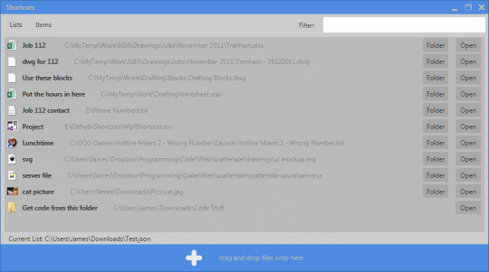

Shortcuts
--------------------------

This is for PC.  It's in C# & WPF and uses the code and project template from the [Csharp-Library](https://github.com/jamesryan83/Csharp-Library) I made a while ago.  I've included the required dlls in this project though so you don't need the library.  You can download a demo [here](http://jamesryan.azurewebsites.net/#/portfolio)

You know when a new job comes in to the office and you write an email to those involved with all the links to the files on the server required to do the job.  This program is an alternative to that.  Same amount of work probably, but alternative nevertheless and it has the proper file icons and stuff

#####Instructions

You drag and drop the files from the server onto the area in the bottom (with the + symbol, see image below) and the shortcuts appear in the list.  You can then drag/drop to rearrange the items in the list or type in the Filter textbox to filter the list

The default name (the bold font on each line) they're given is the filename, but you can change it by clicking on it and typing.  For instance the first file (image below) is called Trenham.xlsx but has been renamed to Job 112

After you have made a list you would then save it, which creates a single json file, and then send the file to your colleagues.  They, also with this program, then open the file and see the same shortcuts with the names you've given them

 

